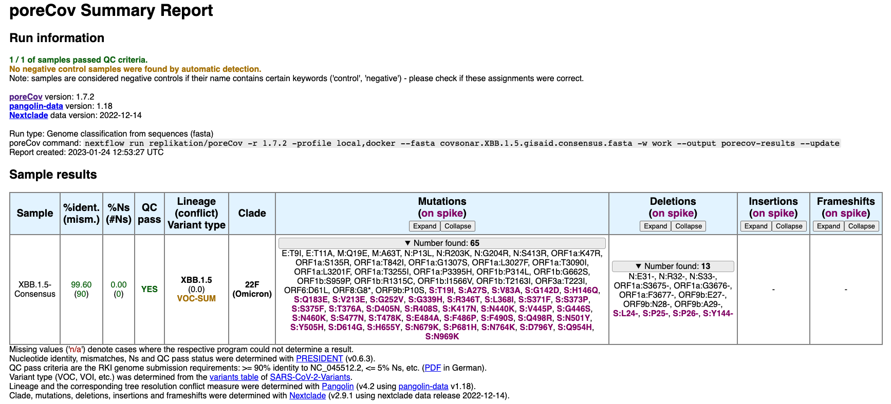
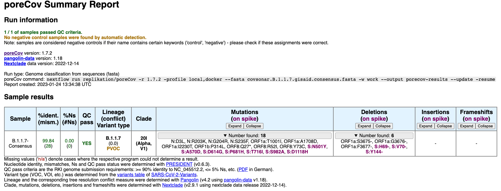

# SARS-CoV-2 consensus creation

**Disclaimer:** This script is not yet fully tested. Please use with caution and report [issues](https://github.com/hoelzer/sc2-consensus-mutation-profile/issues).

## What's happening here?

The international database [GISAID](https://gisaid.org/) counts 14,7 million SARS-CoV-2 genome sequences that are assigned to ~2,800 [lineages](https://cov-lineages.org/) (2023-01-24). For many applications, only representative genome sequences of selected lineages are needed. For example, to design new primers for tiled amplicon sequencing panels or for the selection of mutations for variant-specific PCRs. However, calculating a multiple sequence alignment from which a representative consensus genome sequence can be derived can be challenging due to the high number of sequences per lineage. In addition, sequencing and genome reconstruction errors lead to ambiguous base stretches or frame shifts, complicating the alignment. 

Here, we use a different approach to reconstruct a representative genome sequence per SARS-CoV-2 lineage. We derive pre-calculated mutation profiles per lineage from [covsonar](https://github.com/rki-mf1/covsonar) and calculate the frequency of each mutation. Then, we filter the mutations using a frequency cutoff (default: 75%) and include the detected substitutions, insertions, and deletions into a reference genome sequence (default: NC_045512.2). 

By that, we overcome limitations of a multiple sequence alignment and remove sequencing and genome reconsturction artifacts by focusing on the most representative changes for each annotated lineage. 

## Dependencies

You need a `ruby` installation and the `bioruby` gem. Easiest way:

```bash
conda create -n bioruby -c conda-forge ruby
conda activate bioruby
gem install bio
```

or you can also directly try `gem install bio` because you usually have a `ruby` installed. 

The input for the script needs to be generated via [covsonar](https://github.com/rki-mf1/covsonar).

## Run example 

```bash
# Obtain mutation profiles for XBB.1.5 from a covsonar database constructed on GISIAD sequences. For details see the covsonar repository.
sonar.py match --db gisaid.db --lineage XBB.1.5 --tsv > covsonar.XBB.1.5.gisaid.tsv

# Calculate a merged mutation profile and filter mutation frequencies (default >= 75%, see script). Output a consensus FASTA.
ruby merge-profile.rb covsonar.XBB.1.5.gisaid.tsv

# To quickly check your created consensus sequence and the included mutations, you can run poreCov
nextflow pull replikation/poreCov
nextflow run replikation/poreCov -r 1.7.2 -profile local,docker --fasta covsonar.XBB.1.5.gisaid.consensus.fasta -w work --output porecov-results --update
```

In this example, 9,194 XBB.1.5 mutation profiles were obtained from the GISAID covsonar database and, using a mutation frequency cutoff of 75%, resulted in the following consensus (poreCov analysis):



Here is another example, using 1,194,362 B.1.1.7 (VOC Alpha) mutation profiles from a covsonar GISAID database as input. The resulting consensus:

